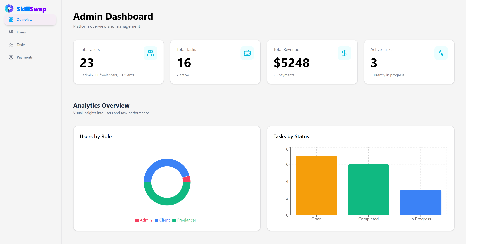

# GiGNEX - Freelance Micro-Task Platform

<p align="center">
  
</p>

<h3 align="center">
A Full Stack Freelance Marketplace Platform
</h3>

<p align="center">
  <a href="https://gi-gnex.vercel.app/">
    
  </a>
  <a href="https://github.com/muradvcv/GiGNEX">
    
  </a>
  <a href="https://github.com/muradvcv/GiGNEX-BACKEND">
    
  </a>
</p>

---

# 🌟 Project Overview

GiGNEX is a modern Freelance Micro-Task Marketplace where clients can post small tasks and freelancers can submit proposals, get hired, complete work, and receive payments securely.

The platform supports three different user roles:

* Client
* Freelancer
* Admin

Clients can create and manage tasks, freelancers can apply and complete projects, and admins can monitor platform activities, users, tasks, and transactions.

---

# 🚀 Live Project

### Live Website

https://gi-gnex.vercel.app/

### Client Repository

https://github.com/muradvcv/GiGNEX

### Server Repository

https://github.com/muradvcv/GiGNEX-BACKEND

---

---

## 🔐 Admin Access

| Field | Value |
|------|------|
| Email | admin@gmail.com |
| Password | Murad123$$ |

---

# ✨ Key Features

## Authentication & Authorization

* Better Auth Authentication
* Email & Password Login
* Google OAuth Login
* JWT Authentication
* HTTPOnly Cookie Security
* Protected Routes
* Role-Based Access Control
* Persistent Login Sessions

---

## Client Features

* Create New Tasks
* Update Existing Tasks
* Delete Tasks
* Manage Posted Tasks
* View Freelancer Proposals
* Accept or Reject Proposals
* Stripe Payment Integration
* Track Project Status
* Dashboard Statistics

---

## Freelancer Features

* Browse Available Tasks
* Search Tasks
* Filter Tasks by Category
* Submit Proposals
* Track Proposal Status
* Active Project Management
* Deliver Work via URL Submission
* Earnings Tracking
* Public Freelancer Profile
* Profile Editing

---

## Admin Features

* User Management
* Block / Unblock Users
* Task Management
* Transaction Monitoring
* Revenue Tracking
* Platform Statistics Dashboard

---

## Payment System

* Stripe Checkout Integration
* Secure Payment Verification
* Payment Success Page
* Transaction History
* Revenue Tracking

---

## Advanced Features

* Dynamic Featured Tasks
* Dynamic Top Freelancers
* Pagination System
* Search Functionality
* Category Filtering
* Review & Rating System
* Responsive Dashboard
* Mobile Sidebar Navigation
* Modern UI Animations
* Custom 404 Page

---

# 🗂 Database Collections

## Users

* name
* email
* image
* role
* skills
* bio
* isBlocked
* createdAt

## Tasks

* title
* category
* description
* budget
* deadline
* client_email
* status
* deliverable_url
* createdAt

## Proposals

* task_id
* freelancer_email
* proposed_budget
* estimated_days
* cover_note
* status
* submitted_at

## Payments

* client_email
* freelancer_email
* task_id
* amount
* transaction_id
* payment_status
* paid_at

## Reviews

* task_id
* reviewer_email
* reviewee_email
* rating
* comment
* created_at

---

# 🛠 Technologies Used

## Frontend

* Next.js 15
* Tailwind CSS
* Hero UI
* Framer Motion
* Lucide React
* React Icons

## Backend

* Node.js
* Express.js
* MongoDB
* JWT
* Better Auth
* Stripe

---

# 📦 NPM Packages

### Frontend

```bash
next
react-dom
tailwindcss
react-hook-form
framer-motion
lucide-react
react-icons
axios
sweetalert2
```

### Backend

```bash
express
mongodb
cors
dotenv
jsonwebtoken
stripe
better-auth
cookie-parser
```

---

# 🔐 Environment Variables

### Frontend

```env
BETTER_AUTH_URL=
BETTER_AUTH_SECRET=
GOOGLE_CLIENT_ID=
GOOGLE_CLIENT_SECRET=
NEXT_PUBLIC_BASE_URL=
NEXT_PUBLIC_STRIPE_PUBLISHABLE_KEY=
```

### Backend

```env
PORT=
MONGO_DB_URI=
AUTH_DB_NAME=
JWT_SECRET=
STRIPE_SECRET_KEY=
CLIENT_URL=
```

---

# 📱 Responsive Design

The application is fully responsive and optimized for:

* Mobile Devices
* Tablets
* Laptops
* Desktop Screens

---

# 👨‍💻 Developer

### Murad

Full Stack Web Developer

GitHub:
https://github.com/muradvcv

---

© 2026 GiGNEX. All Rights Reserved.
